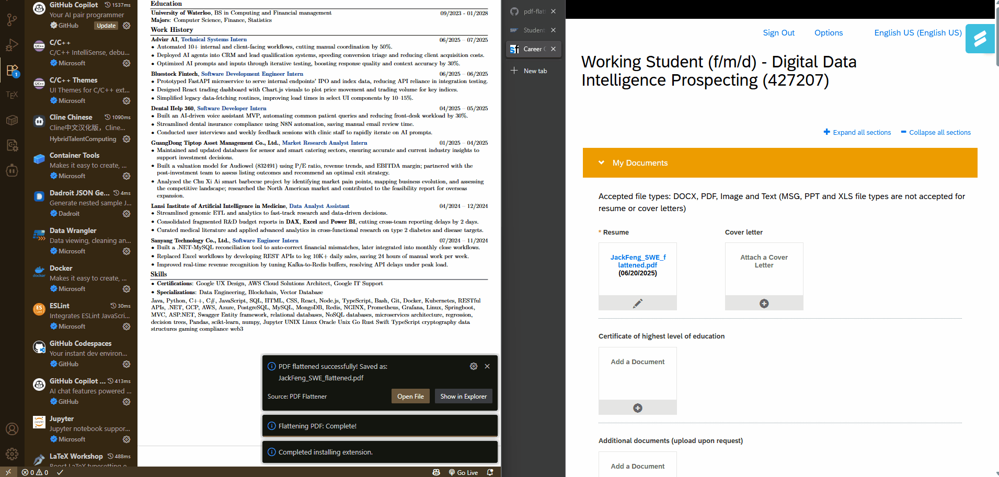

# PDF Flattener VS Code Extension

A VS Code extension that flattens PDF files by removing interactive elements like form fields, annotations, and other dynamic content while preserving the visual appearance.



## Features

- **Flatten PDF Files**: Remove form fields, annotations, and interactive elements
- **Context Menu Integration**: Right-click on PDF files in the explorer to flatten them
- **Command Palette Support**: Use `PDF Flattener: Flatten PDF` command
- **Progress Indication**: Visual progress feedback during processing
- **Automatic Output Naming**: Creates `filename_flattened.pdf` in the same directory
- **Cross-platform**: Works on Windows, macOS, and Linux

## Usage

### Method 1: Context Menu (Recommended)
1. Right-click on any PDF file in the VS Code Explorer
2. Select "Flatten PDF" from the context menu
3. Wait for processing to complete
4. The flattened PDF will be saved in the same directory with `_flattened` suffix

### Method 2: Command Palette
1. Open the Command Palette (`Ctrl+Shift+P` / `Cmd+Shift+P`)
2. Type "PDF Flattener: Flatten PDF" and press Enter
3. Select the PDF file you want to flatten
4. Wait for processing to complete

## What Does "Flattening" Do?

PDF flattening converts a PDF with interactive elements into a static document:

- **Form Fields**: Text boxes, checkboxes, radio buttons, and dropdowns become static text/graphics
- **Annotations**: Comments, highlights, and markup become part of the page content
- **Interactive Elements**: Buttons and links lose their interactive functionality
- **Visual Content**: All text, images, and formatting are preserved exactly as they appear

## Requirements

- VS Code version 1.60.0 or higher
- Node.js (for development)

## Installation

### From VSIX Package
1. Download the `.vsix` file
2. Open VS Code
3. Go to Extensions view (`Ctrl+Shift+X`)
4. Click the "..." menu and select "Install from VSIX..."
5. Select the downloaded `.vsix` file

### From Source
1. Clone this repository
2. Run `npm install` to install dependencies
3. Run `npm run compile` to build the extension
4. Press `F5` to open a new Extension Development Host window

## Development

### Building
```bash
npm install
npm run compile
```

### Watching for Changes
```bash
npm run watch
```

### Testing
1. Open this project in VS Code
2. Press `F5` to open Extension Development Host
3. Test the extension in the new window

## Technical Details

- **PDF Processing**: Uses `pdf-lib` library for reliable PDF manipulation
- **File Handling**: Native Node.js file system operations
- **Error Handling**: Comprehensive error handling with user-friendly messages
- **Performance**: Processes PDFs efficiently with progress indication

## Known Limitations

- Very large PDF files may take longer to process
- Some complex PDF structures might not flatten perfectly
- Encrypted PDFs require password removal before flattening

## Contributing

1. Fork the repository
2. Create a feature branch
3. Make your changes
4. Test thoroughly
5. Submit a pull request

## License

MIT License - see LICENSE file for details

## Changelog

### 1.0.0
- Initial release
- Basic PDF flattening functionality
- Context menu and command palette integration
- Progress indication and error handling
